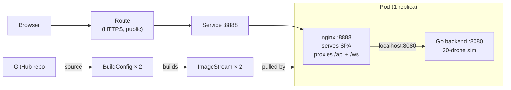

# OpenShift Deployment

> swarm-lite running on the Red Hat OpenShift Developer Sandbox.

**Live URL:** https://swarm-lite-dkmiller321-dev.apps.rm2.thpm.p1.openshiftapps.com

## TL;DR

The app runs as **one Pod with two containers** (backend + nginx) on a free OpenShift cluster. OpenShift builds the images itself from this GitHub repo — nothing is pushed from a local machine. A single public HTTPS Route fronts the whole thing.

## Why this shape

- **One replica.** Drone state lives in memory in the Go process, so scaling beyond one breaks the simulation.
- **Sidecar, not separate Deployments.** Since the backend can't scale anyway, nginx and the backend share a Pod and talk over `localhost`. Cuts the manifest count and removes the need for a backend Service.
- **OpenShift builds the images.** No Docker registry account, no local push. We point a `BuildConfig` at the GitHub repo and the cluster builds + stores the image internally.

## Architecture



## What's on the cluster

| Resource | Purpose |
|---|---|
| `Secret/mapbox-token` | Mapbox token, injected into the frontend at build time |
| `ImageStream` × 2 | Internal storage for the two built images |
| `BuildConfig` × 2 | Tells OpenShift how to build each image from this repo |
| `Deployment/swarm-lite` | One Pod, two containers, `Recreate` strategy |
| `Service/swarm-lite` | ClusterIP on port 8888 |
| `Route/swarm-lite` | Public HTTPS URL with a 24h timeout for WebSockets |

## Code changes required

Three small commits to make the containers play nicely with OpenShift's stricter security model:

1. **`backend/Dockerfile`** — added `USER 1001`. OpenShift refuses to run containers as root.
2. **`frontend/Dockerfile`** — swapped `nginx:alpine` for `nginxinc/nginx-unprivileged:alpine`. Same reason.
3. **`frontend/nginx.conf`** — listens on `8888` (non-root can't bind below 1024) and proxies to `localhost:8080` (sidecar) instead of `backend:8080` (separate service).

Plus one bug fix unrelated to OpenShift but caught by the build:

4. **`frontend/src/hooks/useWebSocket.ts`** — `useRef` needs an initial value under React 19's stricter types.

## Deploy flow

```
git push  →  trigger BuildConfig  →  image built in-cluster  →  pushed to ImageStream
                                                                         ↓
                                       Deployment auto-rolls (image trigger annotation)
```

The `image.openshift.io/triggers` annotation on the Deployment means once a new image lands in the ImageStream, the Pod restarts on the new image automatically.

## Caveats

- **Public URL, no auth.** Anyone can hit the API. Fine for a demo, not for anything real.
- **Single replica only.** No HPA, no rolling updates without downtime — the sim state is in-memory.
- **Mapbox token visible in the JS bundle.** It's a public token by design; restrict it to the Route hostname in the Mapbox dashboard.
- **Manual rebuilds.** New `git push` doesn't auto-trigger a build (no webhook configured). Triggering one requires creating a `Build` object on the cluster.
